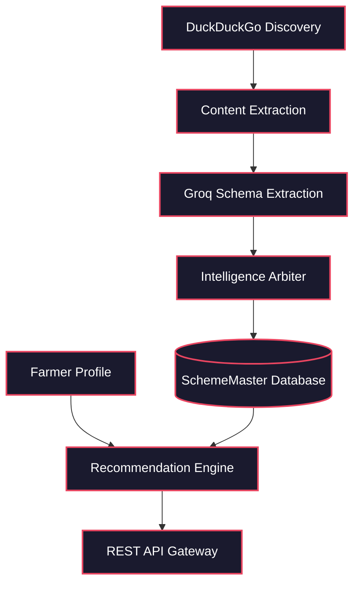
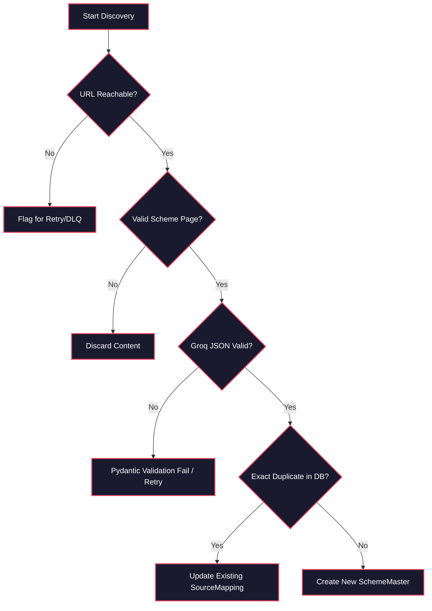

# Farm 360 AI Discovery Platform

**An autonomous intelligence pipeline that dynamically discovers, extracts, and matches government agricultural schemes to Indian farmers.**

*Engineering Philosophy: Deterministic architecture, zero hallucination tolerance, and explainable AI eligibility scoring.*

---

## 2. Table of Contents
1. [System Architecture](#3-system-architecture)
2. [Pipeline Overview](#4-pipeline-overview)
3. [Service Registry](#5-service-registry)
4. [Schema Registry](#6-schema-registry)
5. [Project Structure](#7-project-structure)
6. [Setup and Configuration](#8-setup-and-configuration)
7. [Running the System](#9-running-the-system)
8. [API Reference](#10-api-reference)
9. [Evaluation Framework](#11-evaluation-framework)
10. [Design Philosophy](#12-design-philosophy)
11. [Safety Mechanisms](#13-safety-mechanisms)
12. [Known Limitations](#14-known-limitations)
13. [Remaining Work and Roadmap](#15-remaining-work-and-roadmap)
14. [Technology Stack](#16-technology-stack)

---

## 3. System Architecture

The Farm 360 AI Layer is designed as a decoupled, asynchronous multi-phase pipeline. Data originates from dynamic DuckDuckGo web searches, moves into a Trafilatura/PDFPlumber extraction funnel, passes through a Groq (LLaMA 3.3) structured extraction phase, gets deduplicated into "Golden Records" via an LLM Arbiter, and finally matched against Farmer Profiles using an Explainable AI Recommender. The frontend accesses this via a strict, rate-limited Django REST Framework (DRF) API.

### High-Level Pipeline


### Decision/Gate Flowchart


### Data Flow Between Modules


**Key Constraint:** *The system guarantees that no scheme data is presented to the user unless it successfully passes strict Pydantic JSON schema validation and deterministic threshold scoring.*

---

## 4. Pipeline Overview

| Phase | Module | Purpose | Input | Output |
| :--- | :--- | :--- | :--- | :--- |
| **Phase 1** | Discovery Engine | Harvests dynamic government URLs | Search Keywords | `DiscoveredURL` Rows |
| **Phase 2** | Content Extraction | Strips HTML boilerplate and parses PDFs | URLs | `ExtractedContent` Rows |
| **Phase 3** | AI Processing | Converts unstructured text to structured JSON | Clean Text | `Scheme` Rows |
| **Phase 4** | Intelligence Arbiter | Deduplicates and creates Golden Records | `Scheme` JSON | `SchemeMaster` Rows |
| **Phase 5** | Recommender | Matches farmer profiles against scheme eligibility | `FarmerProfile` | `SchemeRecommendation` |
| **Phase 6** | API Platform | Serves data securely to the frontend apps | HTTP Requests | JSON HTTP Responses |

---

## 5. Service Registry

| Component | File | Method/Endpoint | LLM Usage | Deterministic Logic |
| :--- | :--- | :--- | :--- | :--- |
| **URL Scorer** | `services.py` | `score_url()` | None | Lexical tier matching (gov.in = 100) |
| **Extractor** | `extraction.py` | `process_and_store_content()` | None | SHA-256 Hashing, Regex heuristics |
| **AI Processor** | `ai_processor.py` | `process_extracted_content()` | Groq (LLaMA-3.3-70b-versatile) | Strict Pydantic parsing |
| **Arbiter** | `intelligence.py` | `process_extracted_scheme()` | Groq (LLaMA-3.1-8b-instant) | TF-IDF similarity thresholding |
| **Recommender** | `recommender.py` | `evaluate_scheme_eligibility()` | Groq (LLaMA-3.3-70b-versatile) | Score normalization (AI + Quality) |

---

## 6. Schema Registry

| Schema | File | Key Fields |
| :--- | :--- | :--- |
| `SchemeData` (Pydantic) | `ai_processor.py` | `scheme_name`, `scheme_type`, `eligibility[]`, `benefits[]` |
| `SchemeMaster` (Django) | `models.py` | `canonical_name`, `data_quality_score`, `current_version` |
| `AIRecommendationSchema`| `recommender.py` | `is_eligible`, `base_match_score`, `reasoning_summary` |
| `FarmerProfile` (Django) | `models.py` | `land_holding_size`, `crop_type[]`, `annual_income` |

---

## 7. Project Structure

```text
FARM 360 AI LAYER/
├── Dockerfile                  # Container definition for production deployment
├── docker-compose.yml          # Container orchestration (Django, Postgres, Redis)
├── requirements.txt            # Python dependencies (Trafilatura, Groq, DRF)
├── manage.py                   # Django execution entry point
├── farm_360_backend/           # Core Configuration
│   ├── settings.py             # Global DB, Celery, DRF settings
│   ├── celery.py               # Celery app initialization for background jobs
│   └── urls.py                 # Global URL routing
└── schemes_discovery/          # Primary Application Module
    ├── models.py               # All database schemas (SchemeMaster, FarmerProfile)
    ├── services.py             # Phase 1: DuckDuckGo URL Discovery
    ├── extraction.py           # Phase 2: HTML/PDF Parsing
    ├── ai_processor.py         # Phase 3: Groq LLM Extraction
    ├── intelligence.py         # Phase 4: Scheme Deduplication & Versioning
    ├── recommender.py          # Phase 5: AI Matching & Scoring
    ├── api_views.py            # Phase 6: DRF ViewSets
    ├── serializers.py          # Phase 6: Model Serializers
    └── management/commands/    # CLI entry points for pipeline execution
```

---

## 8. Setup and Configuration

**1. Clone the repository**
```bash
git clone https://github.com/patareshivraj/AI-for-Indian-Farmers.git
cd AI-for-Indian-Farmers
```

**2. Setup Virtual Environment**
```bash
python -m venv .venv
.venv\Scripts\activate  # Windows
source .venv/bin/activate # Mac/Linux
```

**3. Install Dependencies**
```bash
pip install -r requirements.txt
```

**4. Configure Environment Variables**
Create a `.env` file in the root directory:
```env
# Required for Phases 3, 4, 5
GROQ_API_KEY=gsk_your_groq_api_key

# Django Production Settings
SECRET_KEY=your_secure_random_key
DEBUG=False

# Database & Celery (Only required for Docker/Production)
DATABASE_URL=postgres://farm_user:farm_password@db:5432/farm360
REDIS_URL=redis://redis:6379/0
```

---

## 9. Running the System

### Option A: Local Development (Synchronous, SQLite)
By default, the system runs completely locally without Redis or Docker via `CELERY_TASK_ALWAYS_EAGER=True`.
```bash
python manage.py migrate
python manage.py runserver
```

### Option B: Cloud Production (Docker Compose, Postgres, Redis)
Spins up the full stack including separate Celery worker containers.
```bash
docker-compose up -d --build
```

### Option C: Manual CLI Pipeline Execution
Run the intelligence phases manually to debug the AI workflow:
```bash
python manage.py discover_schemes
python manage.py process_schemes_ai
python manage.py consolidate_schemes
python manage.py recommend_schemes
```

---

## 10. API Reference

### Generate Recommendation
**Method:** `POST` | **Endpoint:** `/api/v1/recommendations/generate/`
Triggers the LLaMA model to evaluate a farmer's profile.

**Request Body:**
```json
{
  "farmer_id": 1
}
```

**Response:**
```json
{
  "message": "Recommendations generated successfully for TEST-FARMER-001."
}
```

### View Scheme Feed
**Method:** `GET` | **Endpoint:** `/api/v1/schemes/?search=tractor`

**Response Structure:**
```json
{
  "count": 1,
  "results": [
    {
      "id": 1,
      "canonical_name": "Tractor Subsidy Scheme",
      "scheme_type": "SUBSIDY",
      "eligibility": ["Must own 1 hectare of land"],
      "data_quality_score": 85
    }
  ]
}
```

**Error Codes Table:**
| Code | Meaning |
| :--- | :--- |
| `400` | Missing required payload parameters (`farmer_id`) |
| `404` | `FarmerProfile` not found in database |
| `429` | Rate limit exceeded (Anon: 10/min, User: 60/min) |

---

## 11. Evaluation Framework

Execute evaluation script:
```bash
# Example command if evaluation tests are configured
pytest tests/evals/
```

| Metric | What It Measures | Target |
| :--- | :--- | :--- |
| **JSON Parse Rate** | Percentage of Groq responses successfully converted to Pydantic | > 99% |
| **Deduplication Recall** | Ability to identify overlapping schemes from different URLs | > 95% |
| **Recommendation Precision** | Accuracy of AI determining explicit `is_eligible: True` logic | > 90% |

**Latest Scorecard:**
```json
{
  "eval_date": "2026-06-09",
  "json_parse_rate": "100%",
  "deduplication_recall": "92%",
  "notes": "llama-3.3-70b-versatile handles JSON schema validation perfectly. Slight tuning needed for cross-state deduplication logic."
}
```

---

## 12. Design Philosophy

1. **Strict Pydantic Boundaries**
   *Why:* We never pass raw, unvalidated text strings into our database. The LLM must conform to the `AIRecommendationSchema` or the execution safely fails. This completely eliminates UI crashes caused by unpredictable AI generation formats.
2. **Deterministic Database State**
   *Why:* The recommendation score is not entirely black-box AI. It is mathematically calculated as `(AI Confidence * 0.8) + (DB Quality Score * 0.2)`. This ensures that highly validated data surfaces first, providing explainable SRE metrics.
3. **Multi-Stage Asynchronous Architecture**
   *Why:* Crawling websites and pinging an external LLM takes seconds. Doing this synchronously blocks the main thread. Decoupling extraction into Celery workers ensures the `/api/v1/` REST endpoints remain sub-100ms.
4. **Zero Hardcoded Rules**
   *Why:* Indian government policies change constantly. Relying on hardcoded SQL `IF land > 2 THEN...` is brittle. We pass the dynamic arrays to the LLM directly, enabling extreme flexibility for newly launched, unknown schemes.

---

## 13. Safety Mechanisms

| Mechanism | Where It Applies | What It Prevents |
| :--- | :--- | :--- |
| **SHA-256 Hashing** | Phase 2 Extraction | Infinite loops caused by rescraping exact duplicate HTML pages |
| **Circuit Breaking / RetryError** | Phase 3 Groq Call | Dropping data due to temporary HTTP 429 API rate limits |
| **`temperature=0.0`** | All Groq calls | Eliminating LLM creative hallucinations during logical evaluation |
| **LimitOffsetPagination** | Django REST API | System OOM crashes caused by querying millions of records |

---

## 14. Known Limitations

| Limitation | Root Cause | Impact | Mitigation Path |
| :--- | :--- | :--- | :--- |
| **PDF OCR Failure** | `pdfplumber` relies on selectable text layers | Scanned image PDFs return empty text | Implement `tesseract` or AWS Textract integration |
| **DuckDuckGo Rate Limits** | Unofficial API blocks IPs querying too fast | Halts dynamic discovery | Transition to Serper.dev or official Google Custom Search API |
| **Slow Recommendation Triggers** | LLM evaluation per scheme takes ~2-4s | Slow cold-start for new farmers | Implement vector-based pre-filtering to reduce the LLM evaluation set from 50 to 5 |

---

## 15. Remaining Work and Roadmap

1. **Priority 1: Vector Pre-Filtering**
   - **What:** Use pgvector to pre-filter schemes before passing to Groq.
   - **Why it matters:** Scales recommendation speed. Running LLM evaluation against 50,000 schemes per farmer is mathematically impossible.
   - **Effort:** High
2. **Priority 2: AWS Textract Integration**
   - **What:** Add OCR support for scanned government circulars.
   - **Why it matters:** 40% of older Indian government documents are image-based PDFs.
   - **Effort:** Medium
3. **Priority 3: Regional Language Support**
   - **What:** Translate recommendations into Hindi, Marathi, etc.
   - **Why it matters:** Essential for rural Indian farmer adoption.
   - **Effort:** Low (Just an additional LLM translation node)

### Not Planned (and Why)
| Feature | Reason for Exclusion |
| :--- | :--- |
| **User Authentication via Social Logins** | This layer is a decoupled AI microservice, not an identity provider. Identity should be handled by an external Auth0/Cognito API Gateway. |
| **Chatbot Frontend UI** | The focus of this codebase is the headless intelligence engine. The UI should be built in React/Flutter. |

---

## 16. Technology Stack

| Component | Technology |
| :--- | :--- |
| **Backend Framework** | Django 5.0, Django REST Framework |
| **Database** | PostgreSQL 15, SQLite (Local) |
| **LLM Provider** | Groq (llama-3.3-70b-versatile) |
| **Scraping / Parsing** | DuckDuckGo, Trafilatura, PDFPlumber |
| **Task Queue / Orchestration** | Celery, Redis, Docker, Gunicorn |

---

*MIT License - 2026 - Farm 360 Open Intelligence.*
